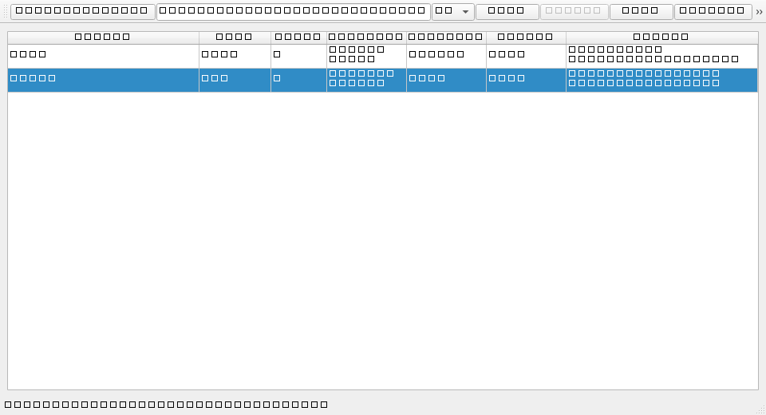
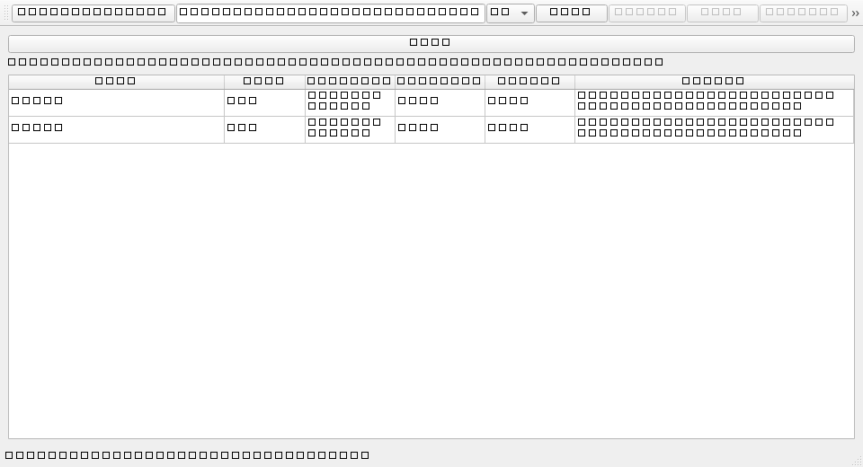
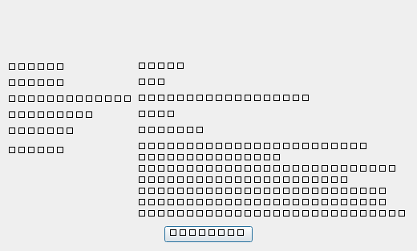
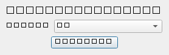

# Folder Analyzer

A disk space analyzer that scans any drive or folder, reports folder sizes, and safely frees disk space by sending files to the Recycle Bin (recoverable). Ships with three front-ends:

- **Interactive CLI** — Rich terminal UI with tables, ASCII treemap, and progress bars.
- **Web UI** — FastAPI backend + static frontend (Caza Bytes branding) with drive stats, sortable table, treemap, and export.
- **Desktop UI** — native PySide6 app (optional extra) with scan, drill-down file view, read-only reasons panel, export, language settings, and the same safety gates as the other surfaces.

## Features

- **Fast multi-threaded scanning** — `ThreadPoolExecutor` for quick large-tree scans
- **Interactive CLI** — Rich tables, trees, and progress bars
- **ASCII + Web treemaps** — Visual share of each folder's disk usage
- **Safety system** — Color-coded risk levels (CRITICAL / CAUTION / SAFE) to protect system folders
- **Scan-root protection** — The scanned folder (and any ancestor) can never be deleted, in CLI and API
- **Safe deletion** — Sends files to the Recycle Bin (recoverable) instead of permanent delete
- **Export reports** — JSON, CSV, or a self-contained HTML report
- **Bilingual** — Full English and Spanish support (CLI `--lang en`/`es`, API `lang` parameter, localized exports, desktop settings)
- **Drill-down + reasons** — Desktop opens per-folder retained files with per-file gates and a read-only details panel
- **Scan cancellation** — CLI/API scans stop on request and are explicitly marked PARTIAL, never presented as silently complete
- **Cross-surface E2E parity** — committed `e2e/` harness verifies CLI/Web/Desktop equivalence (payload-equal JSON exports modulo the volatile `scan_date`) plus the frozen desktop artifact via UI Automation and `--selftest` (Phase 12)

## Installation

Requires **Python 3.10+**.

```bash
git clone https://github.com/Darjona25-code/Folder_Analizer.git
cd Folder_Analizer

# Recommended: install the CLI as a command
python -m venv .venv
# Windows
.venv\Scripts\activate
# Linux/macOS
# source .venv/bin/activate

pip install .
```

This installs the `folder-analyzer` command. Alternatively `pip install -r requirements.txt` works for running from the source tree. For development use `pip install -e ".[dev]"`.

> **Note:** the FastAPI Web UI (`api/`) and its frontend (`web/`) are currently run **from the source tree**; they are not bundled into the wheel distribution.

### Desktop app — packaged build & installer (Windows)

Since **v3.0.0** the desktop app ships as a PyInstaller **onedir bundle**
(`dist/FolderAnalyzer/`, entry `FolderAnalyzer.exe`) and as an Inno Setup
installer (`dist/FolderAnalyzer-Setup-3.0.0.exe`, installed under
`%LOCALAPPDATA%\Programs\FolderAnalyzer`, uninstaller included). The frozen
bundle runs standalone — no Python, venv, or `pip` required — and carries the
single-source locales (`en.json` / `es.json`) bundled inside the artifact.

- Build from source: `python -m PyInstaller --noconfirm --clean --distpath dist --workpath build packaging/FolderAnalyzer.spec`
- Installer: `packaging/build_desktop.ps1` (PyInstaller + `ISCC.exe` for Inno Setup 6)
- Packaged-app verification: `FolderAnalyzer.exe --selftest <report.json>` runs
  the in-bundle checks (version, bundled locales + key parity, scan, the I10
  folder/file gates, and the six-condition guarded delete against a throwaway
  sandbox) and writes a JSON report. The delete boundary and I10 gates are
  executed from the built artifact, not from source.

> **Note (deliberate user decision, Phase 11):** the installer **is not signed**
> with a code-signing certificate (per-user, `PrivilegesRequired=lowest`, no
> admin prompt). On first launch, Windows SmartScreen will show **"Unknown
> Publisher"** and may block the installer until you click **More info → Run
> anyway**. The generated `FolderAnalyzer.exe` bundle itself is a plain
> unpacked-archive layout inside the install dir — treat downloads carefully
> and prefer building from source when full trust is needed. This is a known,
> accepted trade-off; a code-signing certificate is not currently in scope.

The CLI is unaffected by packaging: it continues to be distributed via the
wheel / `folder-analyzer` console entry point only.

## CLI Usage

```bash
# Interactive mode (asks for language, then path)
folder-analyzer

# Specify language and path directly
folder-analyzer --lang es --path C:\

# Other languages / quick scan
folder-analyzer --lang en --path D:\Games
```

Also runnable as a module: `python -m folder_analyzer --lang en --path C:\`

### Menu Options

| Option | Description |
|--------|-------------|
| **1 - View Details** | Drill into folders; the number you type maps to the list shown on screen |
| **2 - Delete** | Mark folders for safe deletion to Recycle Bin (the scan root is always excluded/protected) |
| **3 - Export** | Export report as JSON, CSV, or self-contained HTML |
| **4 - Quit** | Exit the application |

Pressing `Ctrl+C` or ending input (EOF) at any prompt exits cleanly.

### Risk Levels

| Level | Color | Description |
|-------|-------|-------------|
| CRITICAL | Red | System folders (WinSxS, System32, etc.) — **cannot be deleted** |
| CAUTION | Yellow | Program/application folders (Program Files, AppData\Roaming, etc.) — requires confirmation |
| SAFE | Green | User data, caches, temp files — safe to delete |

## Web UI

Run from the source tree (works from any shell, including Git Bash):

```bash
python -m api
```

> Run it as a module: `python api/main.py` or `python api\main.py` fail with
> `ImportError: attempted relative import` (and in Git Bash a backslash breaks
> the path). Use `python -m api`.

Then open <http://127.0.0.1:8000>. The interface shows drive stats plus the scanned folder's own stats (path, total, files, folders), a sortable folder table, a treemap, and export to JSON/CSV/HTML.

> **Scan state is in-memory (per process).** Restarting the server clears the last scan. Automatic reload is opt-in so it never silently wipes state:
>
> ```bash
> # Windows
> set FOLDER_ANALYZER_RELOAD=1
> # Linux/macOS
> export FOLDER_ANALYZER_RELOAD=1
> ```

### API Endpoints

| Method | Path | Purpose |
|--------|------|---------|
| `POST` | `/api/scan` | Scan a folder. Body `{"path": "..."}`. Returns root tree, stats, top folders, and a `cancelled` flag |
| `POST` | `/api/scan/cancel` | Request cancellation of an in-flight scan (partial result returned, marked `cancelled: true`) |
| `GET` | `/api/folders` | Top folder list from the last scan (`?limit=50`) |
| `GET` | `/api/stats` | Total size/files/folders + scan path of the last scan |
| `POST` | `/api/delete` | Send folders to Recycle Bin. Body `{"paths":[...]}`. Scanned root + ancestors, and CRITICAL paths are always blocked |
| `POST` | `/api/export` | Export report. Body `{"format":"json\|csv\|html","lang":"en\|es"}` |
| `GET` | `/api/drives` | Available disks with `label`, used/free/total, percent |
| `GET` | `/` | Web UI (static `index.html`) |

Endpoints that read scan state return `400` until a scan has been performed in the current process.

## Desktop UI

Run from the source tree (PySide6 must be installed — `pip install -e ".[desktop]"`):

```bash
python -m desktop_app
```

or via the `folder-analyzer-desktop` script, or the packaged
`FolderAnalyzer.exe` (see Installation → Desktop app). Pick a folder, scan, then use the
table the same way as the web UI: rows are sorted by size with a localized
recommendation / confidence / impact / reason; **Open** drills into a folder's
retained files, **Details** opens a read-only reasons panel, **Export** writes a
JSON/CSV/HTML v2 report, and **Settings** changes the language (persisted under
your user profile and applied next launch). Delete is gated identically on every
surface: `validatable → confirm → revalidated → Recycle Bin`, and the I10 rule
(`deletable && recommendation == safe_to_delete`) is applied per folder row AND
per drill-down file row, so a `SAFE_TO_DELETE` file inside a `REVIEW_FIRST`
parent stays individually actionable.

| Main table (EN) | Drill-down (EN) |
|---|---|
|  |  |

| Details panel (ES) | Settings (ES) |
|---|---|
|  |  |

## Project Structure

```
Folder_Analizer/
├── folder_analyzer/           # Core package (CLI)
│   ├── __init__.py            # Package version
│   ├── __main__.py            # Entry point + interactive menu
│   ├── scanner.py             # Multi-threaded disk scanner
│   ├── reporter.py            # Rich tables and tree view
│   ├── treemap.py             # Treemap visualization
│   ├── deleter.py             # Safe deletion via Recycle Bin (iterative, protected paths)
│   ├── safety.py              # Risk level detection
│   ├── exporter.py            # JSON/CSV/HTML export (localized)
│   ├── i18n.py                # English/Spanish translations
│   └── utils.py               # Helper functions
├── desktop_app/               # PySide6 desktop UI (Phase 9 → Phase 10)
│   ├── __main__.py            # `python -m desktop_app`
│   ├── app.py                 # Qt application bootstrap
│   ├── controller.py          # Qt-free logic: scan/rows/drill-down/gated delete/export
│   ├── main_window.py         # Qt view: table, drill-down, toolbar, dialogs
│   ├── worker.py              # QThread scan worker (core Scanner)
│   ├── details_dialog.py      # Read-only reasons panel
│   ├── export_dialog.py       # JSON/CSV/HTML export (core exporter v2)
│   ├── settings.py            # Language-only persistence (user profile)
│   ├── settings_dialog.py     # Language settings dialog
│   └── selftest.py            # `--selftest` artifact verification (Phase 11)
├── packaging/                 # Phase 11: PyInstaller spec + Inno Setup script
├── e2e/                       # Phase 12: scripted E2E harness (CLI/Web/Desktop + frozen artifact)
├── tests/                     # 400 unit + integration tests (2 skipped)
├── archive/                   # Non-active material (benchmarks, release installer)
├── api/                       # FastAPI backend (Web UI)
│   ├── main.py                # App + static file mounting + entry point
│   ├── routes.py              # REST endpoints
│   ├── models.py              # Pydantic models (scan/delete/export/drives)
│   └── __main__.py            # `python -m api`
├── web/                       # Static frontend
│   ├── index.html
│   ├── css/style.css
│   ├── js/app.js
│   └── assets/                # Branding (Caza Bytes)
├── docs/                      # Roadmap, architecture, safety, ADR, screenshots
├── requirements.txt
├── pyproject.toml
├── LICENSE                    # MIT
└── README.md
```

## Running Tests

```bash
pip install pytest
pytest tests/
```

400 tests (2 skipped) cover the scanner, safety rules, deletion (protected paths, iterative traversal), the CLI (EOF handling, drill-down, cancellation announcement), exports (localization + v2 determinism and cancelled-markers), the API (state, root protection, cancellation), recommendation/composition, locale parity, knowledge-base cache parity, web-asset audits, and the desktop UI (headless via `QT_QPA_PLATFORM=offscreen`: drill-down I10 gates, evicted notice, reasons panel, export dialog, settings persistence, live EN/ES re-localization, artifact self-test). A committed scripted E2E harness (`e2e/`, Phase 12) verifies cross-surface parity — CLI EN/ES subprocesses, Web `TestClient`, Desktop offscreen Qt, **JSON export content-parity across the three surfaces (payload-equal modulo the volatile `scan_date`; the raw files are not byte-identical)**, live re-localization on source and on the frozen exe, a frozen-artifact UI Automation session, and the artifact `--selftest` (34/34 checks). Run individual files with `pytest tests/test_<area>.py`.

## Dependencies

- [Rich](https://github.com/Textualize/rich) — Terminal UI (tables, trees, progress bars)
- [send2trash](https://github.com/thesophist/send2trash) — Cross-platform Recycle Bin support
- [psutil](https://github.com/giampaolo/psutil) — System/disk utilities
- [colorama](https://github.com/tartley/colorama) — Cross-platform terminal colors
- [FastAPI](https://fastapi.tiangolo.com/) + [Uvicorn](https://www.uvicorn.org/) — Web backend
- [aiofiles](https://github.com/Tinche/aiofiles) — Async file support (FastAPI static)
- [httpx](https://www.python-httpx.org/) — API test client
- [PySide6](https://doc.qt.io/qtforpython-6/) — Desktop UI (optional `desktop` extra)

## License

MIT License — see [LICENSE](LICENSE) for details.